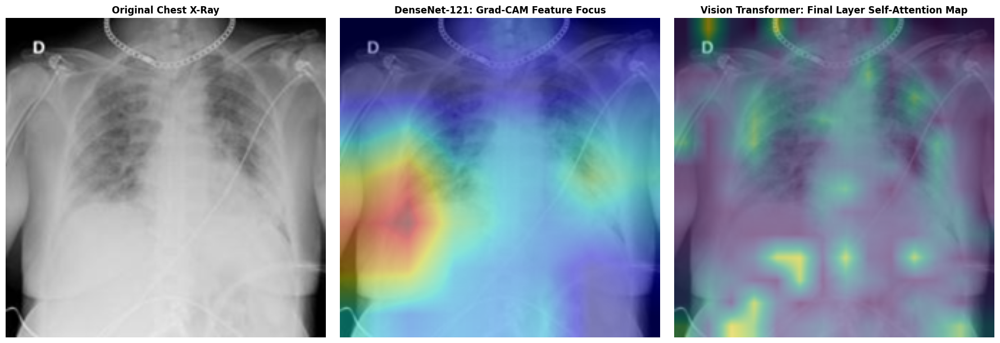

# Explainable AI (XAI) Framework for Automated Pneumonia and COVID-19 Diagnostics

[](https://tensorflow.org)
[](https://huggingface.co)

A comparative medical computer vision and interpretability pipeline evaluating traditional grid-convolutional architectures (**DenseNet-121**) against global multi-head self-attention networks (**ViT-B16**) for 3-class chest radiograph classification (*COVID-19, Normal, and Viral Pneumonia*). 

To bridge the gap between "black-box" deep learning models and clinical trust, this project moves completely beyond qualitative visual aesthetics by computing structural localization (**Shannon Entropy**) and operational faithfulness (**Area Over Perturbation Curve - AOPC**) to quantitatively validate post-hoc visual explanations.

---

## 📂 Repository Structure

```text
ExCV/                            # Main Project Root Workspace
│
├── assets/                      # Visual verification deliverables
│   ├── aopc_evaluation_curve.png    # Quantitative model faithfulness decay curve
│   ├── densenet_training_curves.png # Validation accuracy/loss curves for the CNN
│   ├── vit_training_curve.png       # Validation accuracy/loss curves for the Transformer
│   ├── xray_sample.jpg              # Raw unannotated test radiograph sample file
│   └── xai_comparison.png           # Three-panel visual comparison matrix
│
├── notebooks/                   # Prototyping and pipeline execution
│   └── 01_eda_and_training.ipynb    # Main end-to-end data processing, training, and XAI code
│
├── .gitignore                   # Excludes large checkpoint binaries and datasets
├── demo.py                      # Standalone command-line diagnostic inference script
└── requirements.txt             # Package dependencies manifest
```

---

## 📊 Core Performance & Verification Metrics

### 1. Diagnostic Performance Summary

Both networks were fine-tuned via transfer learning over identical splits at a $224 \times 224 \times 3$ input scale.

| Model Architecture | Test Loss | Test Accuracy | Test Precision | Test Recall |
| --- | --- | --- | --- | --- |
| **DenseNet-121 (CNN Baseline)** | 0.1866 | **93.79%** | 93.79% | 93.79% |
| **Vision Transformer (ViT-B16)** | 0.3346 | **86.90%** | 87.11% | 84.50% |

### 2. Quantitative Faithfulness Verification
Visual heatmaps can occasionally be deceptive or highlight random artifacts. To mathematically prove that the models rely on actual lung pathologies, the saliency maps were verified using two rigorous evaluation criteria:
* **Saliency Map Shannon Entropy (DenseNet-121):** `5.0399 bits` (Indicates a highly localized, structurally focused explanation pattern within lung regions rather than diffuse global noise).
* **Global Dataset AOPC Score:** `0.2589` (Area Over Perturbation Curve computed dynamically over 50 random test samples via feature-level activation masking at the terminal `relu` grid layer).

---

## 📸 Visual Explanation Output

Below is a diagnostic comparison generated from the evaluation pipeline showing the original radiograph alongside its corresponding CNN (Grad-CAM) and Transformer (Attention Rollout) maps:



*Detailed methodologies, data preprocessing steps, training experiments, exhaustive interpretability reviews, and the technical research gap regarding Out-of-Distribution (OOD) perturbation artifacts for the **Bonus Task** are covered in full within the separate project documentation report.*

### Key Interpretations:
* **DenseNet-121 (Grad-CAM):** Demonstrates strong local feature capture, isolating high-frequency boundaries and specific patches of consolidation/ground-glass opacities in the lung fields.
* **Vision Transformer (Attention Rollout):** Demonstrates broad global context tracking, highlighting structural contours across the chest cavity and indicating how distinct anatomical regions correlate to inform final global predictions.

---

## 🚀 Getting Started & Local Setup

### 1. Installation & Dependencies

```bash
git clone [https://github.com/gargi-m21/ExCV-project.git](https://github.com/gargi-m21/ExCV-project.git)
cd ExCV-project
pip install -r requirements.txt

```

### 2. Execution Pipeline

To run the full data processing, training sequence, and evaluation metrics suite interactively:

```bash
jupyter notebook notebooks/01_eda_and_training.ipynb

```

To run a rapid structural compilation check and generate a visual dashboard matrix using your saved local checkpoint weights:

```bash
python demo.py

```
